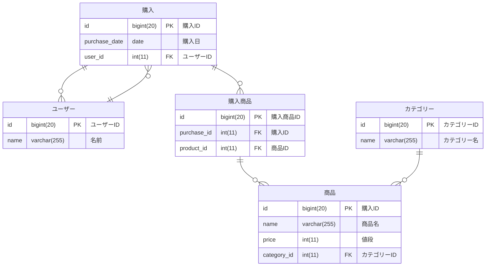

## ER 図を書くことができる

### 1. ER 図

EC サイトの第3正規形の設計を、ER 図にする  
各テーブルがどのようなデータを持っており、テーブル間がどのような関連をしているかをER図で表現する  

### [購入テーブル]
| 購入ID(PK) | 購入日  | ユーザーID |
| -------- | ---- | ------ |
| 1        | 4/14 | 1      |
| 2        | 4/17 | 1      |
| 3        | 4/18 | 2      |
| 4        | 4/19 | 3      |

### [ユーザーテーブル]
| ユーザーID(PK) | 名前   |
| ---------- | ---- |
| 1          | 山田太郎 |
| 1          | 山田太郎 |
| 2          | 田中花子 |
| 3          | 鈴木一郎 |

### [購入商品テーブル]
| 購入ID(PK) | 商品ID |
| -------- | ---- |
| 1        | 1    |
| 2        | 2    |
| 3        | 3    |
| 3        | 4    |
| 4        | 5    |
| 4        | 6    |

### [商品テーブル]
| 商品ID(PK) | 商品名                             | 値段      | カテゴリーID |
| -------- | ------------------------------- | ------- | ------- |
| 1        | iPhone 13                       | 100,000 | 6       |
| 2        | キリン一番搾り生ビール10本                  | 2,000   | 5       |
| 3        | MacBook Air M2                  | 164,800 | 4       |
| 4        | 綾鷹                              | 120     | 3       |
| 5        | HHKB Professional HYBRID Type-S | 36,850  | 2       |
| 6        | MX ERGO                         | 15,000  | 1       |

### [カテゴリーテーブル]
| カテゴリーID(PK) | カテゴリー名  |
| ----------- | ------- |
| 1           | マウス     |
| 2           | キーボード   |
| 3           | 緑茶      |
| 4           | PC      |
| 5           | ビール     |
| 6           | スマートフォン |

### [ER図]

