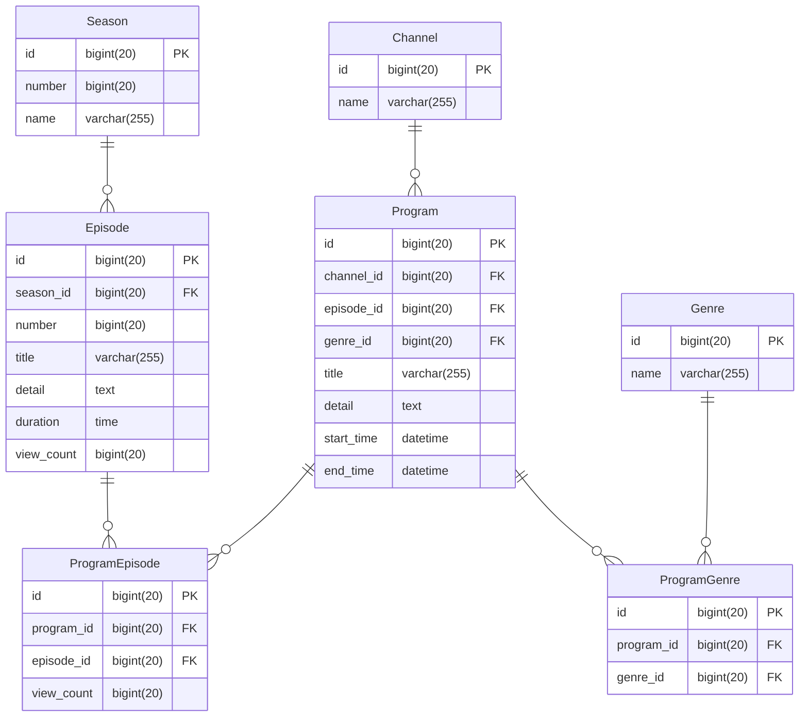

# インターネットTV

## 概要
[ABEMA](https://abema.tv/)のような「インターネットTVサービス」のデータベース設計を行う  

## 仕様
- 複数のチャンネルがある
- 各チャンネルに時間帯ごとに番組枠が設定されている
- 番組はシリーズモノと単発モノがある
- シリーズモノは1シーズンのものと複数シーズンのものがある
- シリーズモノには各エピソードが設定されている
- 再放送があり、番組が複数チャンネルの異なる時間帯で放映される場合がある
- 番組情報として、以下が画面上に表示される
  - タイトル
  - 番組詳細
  - ジャンル
- 各エピソード情報として、以下が画面上に表示される
  - シーズン数 (※単発エピソードの場合は表示されない)
  - エピソード数 (※単発エピソードの場合は表示されない)
  - タイトル
  - エピソード詳細
  - 動画時間
  - 公開日
  - 視聴数
- 各番組は1つ以上のジャンルに属する
- ジャンル情報として、以下が存在する
  - アニメ
  - 映画
  - ドラマ
  - ニュース
- KPIとして、チャンネルの番組枠のエピソード毎に視聴数を記録する
- 1つのエピソードは複数の異なるチャンネル及び番組枠で放送されることがあるため、属するチャンネルの番組枠毎の視聴数についても記録する

## 例(シリーズモノ)
  - 番組：鬼滅の刃
  - シーズン：1
  - エピソード：1話、2話、...、26話

## ステップ1
データベース設計をする  
テーブルごとに以下を定義する
- テーブル名
- カラム名
- データ型
- NULL(NULL OK の場合のみ YES と記載)
- キー（キーが存在する場合、PRIMARY/INDEX のどちらかを記載）
- 初期値（ある場合のみ記載）
- AUTO INCREMENT（ある場合のみ YES と記載）
- 外部キー制約
- ユニークキー制約

以下のポイントを抑えること
- アプリケーションとして成立すること(プログラムを組んだ際に仕様を満たして動作すること)
- 正規化されていること

### エンティティ
- チャンネル
- 番組
- ジャンル
- シーズン
- エピソード

### ER図


### テーブル定義
### [channels テーブル]
テーブル名： channels
| COLUMN | DATA TYPE    | NULL | KEY     | DEFAULT | AUTO INCREMENT |
| ------ | ------------ | ---- | ------- | ------- | -------------- |
| id     | bigint(20)   |      | PRIMARY |         | YES            |
| name   | varchar(255) |      |         |         |                |

### [programs テーブル]
テーブル名： programs
| COLUMN     | DATA TYPE    | NULL | KEY     | DEFAULT | AUTO INCREMENT |
| ---------- | ------------ | ---- | ------- | ------- | -------------- |
| id         | bigint(20)   |      | PRIMARY |         | YES            |
| channel_id | bigint(20)   | YES  |         |         |                |
| episode_id | bigint(20)   | YES  |         |         |                |
| genre_id   | bigint(20)   | YES  |         |         |                |
| title      | varchar(255) |      |         |         |                |
| detail     | text         |      |         |         |                |
| start_time | datetime     |      |         |         |                |
| end_time   | datetime     |      |         |         |                |

- 外部キー制約： channel_id に対して、 channels テーブルの id カラムから設定
- 外部キー制約： episode_id に対して、 episodes テーブルの id カラムから設定
- 外部キー制約： genre_id に対して、 genres テーブルの id カラムから設定

### [seasons テーブル]
テーブル名： seasons
| COLUMN | DATA TYPE    | NULL | KEY     | DEFAULT | AUTO INCREMENT |
| ------ | ------------ | ---- | ------- | ------- | -------------- |
| id     | bigint(20)   |      | PRIMARY |         | YES            |
| number | bigint(20)   |      |         |         |                |
| name   | varchar(255) |      |         |         |                |

### [program - episodes テーブル]
テーブル名： program_episodes
| COLUMN     | DATA TYPE  | NULL | KEY     | DEFAULT | AUTO INCREMENT |
| ---------- | ---------- | ---- | ------- | ------- | -------------- |
| id         | bigint(20) |      | PRIMARY |         | YES            |
| program_id | bigint(20) | YES  |         |         |                |
| episode_id | bigint(20) | YES  |         |         |                |
| view_count | bigint(20) |      |         | 0       |                |

- 外部キー制約： program_id に対して、 programs テーブルの id カラムから設定
- 外部キー制約： episode_id に対して、 episodes テーブルの id カラムから設定

### [program - genres テーブル]
テーブル名： program_genres
| COLUMN     | DATA TYPE  | NULL | KEY     | DEFAULT | AUTO INCREMENT |
| ---------- | ---------- | ---- | ------- | ------- | -------------- |
| id         | bigint(20) |      | PRIMARY |         | YES            |
| program_id | bigint(20) | YES  |         |         |                |
| genre_id  | bigint(20) | YES  |         |         |                |

- 外部キー制約： program_id に対して、 programs テーブルの id カラムから設定
- 外部キー制約： genres_id に対して、 genres テーブルの id カラムから設定

### [episodes テーブル]
テーブル名： episodes
| COLUMN     | DATA TYPE    | NULL | KEY     | DEFAULT | AUTO INCREMENT |
| ---------- | ------------ | ---- | ------- | ------- | -------------- |
| id         | bigint(20)   |      | PRIMARY |         | YES            |
| season_id  | bigint(20)   | YES  |         |         |                |
| number     | bigint(20)   | YES  |         |         |                |
| title      | varchar(255) |      |         |         |                |
| detail     | text         |      |         |         |                |
| duration   | time         |      |         |         |                |
| view_count | bigint(20)   |      |         | 0       |                |

- 外部キー制約： season_id に対して、 seasons テーブルの id カラムから設定

### [genres テーブル]
テーブル名： genres
| COLUMN | DATA TYPE    | NULL | KEY     | DEFAULT | AUTO INCREMENT |
| ------ | ------------ | ---- | ------- | ------- | -------------- |
| id     | bigint(20)   |      | PRIMARY |         | YES            |
| name   | varchar(255) |      |         |         |                |


## ステップ2
実際にテーブルを構築し、データを格納する  
手順をドキュメント化する  

### 手順概要
1. データベース構築
2. ステップ1で設計したテーブルの構築
3. サンプルデータ格納

### 目的
- データを実際に入れることでステップ3でデータ抽出クエリを試せるようにする
- 手順をドキュメントにまとめることで、自身がやり直したい時にすぐやり直せるようにする
- 手順を人が同じように行えるようにまとめることで、ドキュメントコミュニケーション力を上げる

### 手順詳細
1. データベース構築
```sql
CREATE DATABASE internet_tv;
USE internet_tv;
```

2. ステップ1で設計したテーブルの構築
```sql
CREATE TABLE channels (
  id              BIGINT(20)    NOT NULL PRIMARY KEY,
  name            VARCHAR(255)  NOT NULL             
);

CREATE TABLE seasons (
  id              BIGINT(20)    NOT NULL PRIMARY KEY,
  number          BIGINT(20)    NOT NULL            ,
  name            VARCHAR(255)  NOT NULL             
);

CREATE TABLE genres (
  id              BIGINT(20)    NOT NULL PRIMARY KEY,
  name            VARCHAR(255)  NOT NULL             
);

CREATE TABLE episodes (
  id              BIGINT(20)    NOT NULL PRIMARY KEY,
  season_id       BIGINT(20)                        ,
  number          BIGINT(20)    NOT NULL            ,
  title           VARCHAR(255)  NOT NULL            ,
  detail          TEXT          NOT NULL            ,
  duration        TIME          NOT NULL            ,
  view_count      BIGINT(20)    NOT NULL            ,
  FOREIGN KEY     fk_season_id(season_id)            
  REFERENCES      seasons(id)                        
);

CREATE TABLE programs (
  id              BIGINT(20)    NOT NULL PRIMARY KEY,
  channel_id      BIGINT(20)                        ,
  episode_id      BIGINT(20)                        ,
  genre_id        BIGINT(20)    NOT NULL            ,
  title           VARCHAR(255)  NOT NULL            ,
  detail          TEXT          NOT NULL            ,
  start_time      DATETIME      NOT NULL            ,
  end_time        DATETIME      NOT NULL            ,
  FOREIGN KEY     fk_channel_id(channel_id)          
  REFERENCES      channels(id)                      ,
  FOREIGN KEY     fk_episode_id(episode_id)          
  REFERENCES      episodes(id)                      ,
  FOREIGN KEY     fk_genre_id(genre_id)              
  REFERENCES      genres(id)                         
);

CREATE TABLE program_episodes (
  id              BIGINT(20)    NOT NULL PRIMARY KEY,
  program_id      BIGINT(20)                        ,
  episode_id      BIGINT(20)                        ,
  view_count      BIGINT(20)    DEFAULT 0           ,
  FOREIGN KEY     fk_program_id(program_id)          
  REFERENCES      programs(id)                      ,
  FOREIGN KEY     fk_episode_id(episode_id)          
  REFERENCES      episodes(id)                       
);

CREATE TABLE program_genres (
  id              BIGINT(20)    NOT NULL PRIMARY KEY,
  program_id      BIGINT(20)                        ,
  genre_id        BIGINT(20)                        ,
  FOREIGN KEY     fk_program_id(program_id)          
  REFERENCES      programs(id)                      ,
  FOREIGN KEY     fk_genre_id(genre_id)              
  REFERENCES      genres(id)                         
);
```

3. サンプルデータ格納
```sql
INSERT INTO channels (id, name)
VALUES
(1, 'Channel 1'),
(2, 'Channel 2'),
(3, 'Channel 3'),
(4, 'Channel 4'),
(5, 'Channel 5'),
(6, 'Channel 6'),
(7, 'Channel 7'),
(8, 'Channel 8'),
(9, 'Channel 9'),
(10, 'Channel 10');

INSERT INTO seasons (id, number, name)
VALUES
(1, 1, 'Season 1'),
(2, 2, 'Season 2'),
(3, 3, 'Season 3'),
(4, 4, 'Season 4'),
(5, 5, 'Season 5'),
(6, 6, 'Season 6'),
(7, 7, 'Season 7'),
(8, 8, 'Season 8'),
(9, 9, 'Season 9'),
(10, 10, 'Season 10');

INSERT INTO genres (id, name)
VALUES
(1, 'Genre 1'),
(2, 'Genre 2'),
(3, 'Genre 3'),
(4, 'Genre 4'),
(5, 'Genre 5'),
(6, 'Genre 6'),
(7, 'Genre 7'),
(8, 'Genre 8'),
(9, 'Genre 9'),
(10, 'Genre 10');

INSERT INTO episodes (id, season_id, number, title, detail, duration, view_count)
VALUES
(1, 1, 1, 'Episode 1', 'Episode 1 description', '00:30:00', 500),
(2, 1, 2, 'Episode 2', 'Episode 2 description', '00:45:00', 400),
(3, 2, 1, 'Episode 1', 'Episode 1 description', '00:30:00', 600),
(4, 2, 2, 'Episode 2', 'Episode 2 description', '00:45:00', 300),
(5, 3, 1, 'Episode 1', 'Episode 1 description', '00:30:00', 700),
(6, 3, 2, 'Episode 2', 'Episode 2 description', '00:45:00', 200),
(7, 4, 1, 'Episode 1', 'Episode 1 description', '00:30:00', 800),
(8, 4, 2, 'Episode 2', 'Episode 2 description', '00:45:00', 100),
(9, 5, 1, 'Episode 1', 'Episode 1 description', '00:30:00', 900),
(10, 5, 2, 'Episode 2', 'Episode 2 description', '00:45:00', 50);


INSERT INTO programs (id, channel_id, episode_id, genre_id, title, detail, start_time, end_time)
VALUES
(1, 1, 1, 1, 'Program 1', 'Program 1 description', '2023-05-28 08:00:00', '2023-05-28 09:00:00'),
(2, 1, 2, 2, 'Program 2', 'Program 2 description', '2023-05-28 09:00:00', '2023-05-28 10:00:00'),
(3, 2, 3, 1, 'Program 3', 'Program 3 description', '2023-05-28 10:00:00', '2023-05-28 11:00:00'),
(4, 2, 4, 3, 'Program 4', 'Program 4 description', '2023-05-28 11:00:00', '2023-05-28 12:00:00'),
(5, 3, 5, 2, 'Program 5', 'Program 5 description', '2023-05-28 12:00:00', '2023-05-28 13:00:00'),
(6, 3, 6, 1, 'Program 6', 'Program 6 description', '2023-05-28 13:00:00', '2023-05-28 14:00:00'),
(7, 4, 7, 3, 'Program 7', 'Program 7 description', '2023-05-28 14:00:00', '2023-05-28 15:00:00'),
(8, 4, 8, 2, 'Program 8', 'Program 8 description', '2023-05-28 15:00:00', '2023-05-28 16:00:00'),
(9, 5, 9, 1, 'Program 9', 'Program 9 description', '2023-05-28 16:00:00', '2023-05-28 17:00:00'),
(10, 5, 10, 3, 'Program 10', 'Program 10 description', '2023-05-28 17:00:00', '2023-05-28 18:00:00');

INSERT INTO program_genres (id, program_id, genre_id)
VALUES
(1, 1, 1),
(2, 1, 2),
(3, 2, 2),
(4, 2, 3),
(5, 3, 1),
(6, 3, 3),
(7, 4, 3),
(8, 4, 4),
(9, 5, 2),
(10, 5, 4);

INSERT INTO program_episodes (id, program_id, episode_id, view_count)
VALUES
(1, 1, 1, 100),
(2, 1, 2, 50),
(3, 2, 3, 80),
(4, 2, 4, 120),
(5, 3, 5, 90),
(6, 3, 6, 70),
(7, 4, 7, 110),
(8, 4, 8, 60),
(9, 5, 9, 95),
(10, 5, 10, 75);

INSERT INTO episodes (id, season_id, number, title, detail, duration, view_count)
VALUES
(1, 1, 1, 'Episode 1', 'Episode 1 description', '00:30:00', 500),
(2, 1, 2, 'Episode 2', 'Episode 2 description', '00:45:00', 400),
(3, 2, 1, 'Episode 1', 'Episode 1 description', '00:30:00', 600),
(4, 2, 2, 'Episode 2', 'Episode 2 description', '00:45:00', 300),
(5, 3, 1, 'Episode 1', 'Episode 1 description', '00:30:00', 700),
(6, 3, 2, 'Episode 2', 'Episode 2 description', '00:45:00', 200),
(7, 4, 1, 'Episode 1', 'Episode 1 description', '00:30:00', 800),
(8, 4, 2, 'Episode 2', 'Episode 2 description', '00:45:00', 100),
(9, 5, 1, 'Episode 1', 'Episode 1 description', '00:30:00', 900),
(10, 5, 2, 'Episode 2', 'Episode 2 description', '00:45:00', 50);
```

## ステップ3


