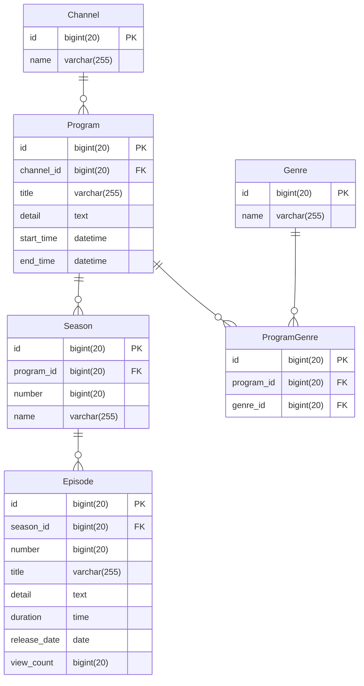

# インターネットTV

## 概要
[ABEMA](https://abema.tv/)のような「インターネットTVサービス」のデータベース設計を行う  

## 仕様
<details open>

- 複数のチャンネルがある
- 各チャンネルに時間帯ごとに番組枠が設定されている
- 番組はシリーズモノと単発モノがある
- シリーズモノは1シーズンのものと複数シーズンのものがある
- シリーズモノには各エピソードが設定されている
- 再放送があり、番組が複数チャンネルの異なる時間帯で放映される場合がある
- 番組情報として、以下が画面上に表示される
  - タイトル
  - 番組詳細
  - ジャンル
- 各エピソード情報として、以下が画面上に表示される
  - シーズン数 (※単発エピソードの場合は表示されない)
  - エピソード数 (※単発エピソードの場合は表示されない)
  - タイトル
  - エピソード詳細
  - 動画時間
  - 公開日
  - 視聴数
- 各番組は1つ以上のジャンルに属する
- ジャンル情報として、以下が存在する
  - アニメ
  - 映画
  - ドラマ
  - ニュース
- KPIとして、チャンネルの番組枠のエピソード毎に視聴数を記録する
- 1つのエピソードは複数の異なるチャンネル及び番組枠で放送されることがあるため、属するチャンネルの番組枠毎の視聴数についても記録する

</details>

## 例(シリーズモノ)
  - 番組：鬼滅の刃
  - シーズン：1
  - エピソード：1話、2話、...、26話

## ステップ1
<details open>

データベース設計をする  
テーブルごとに以下を定義する
- テーブル名
- カラム名
- データ型
- NULL(NULL OK の場合のみ YES と記載)
- キー（キーが存在する場合、PRIMARY/INDEX のどちらかを記載）
- 初期値（ある場合のみ記載）
- AUTO INCREMENT（ある場合のみ YES と記載）
- 外部キー制約
- ユニークキー制約

以下のポイントを抑えること
- アプリケーションとして成立すること(プログラムを組んだ際に仕様を満たして動作すること)
- 正規化されていること

</details>

<details open>

### エンティティ
- チャンネル
- 番組
- ジャンル
- シーズン
- エピソード

</details>

### ER図



</details>

### テーブル定義
<details open>

### [channels テーブル]
テーブル名： channels
| COLUMN | DATA TYPE    | NULL | KEY     | DEFAULT | AUTO INCREMENT |
| ------ | ------------ | ---- | ------- | ------- | -------------- |
| id     | bigint(20)   |      | PRIMARY |         | YES            |
| name   | varchar(255) |      |         |         |                |

### [programs テーブル]
テーブル名： programs
| COLUMN     | DATA TYPE    | NULL | KEY     | DEFAULT | AUTO INCREMENT |
| ---------- | ------------ | ---- | ------- | ------- | -------------- |
| id         | bigint(20)   |      | PRIMARY |         | YES            |
| channel_id | bigint(20)   | YES  |         |         |                |
| title      | varchar(255) |      |         |         |                |
| detail     | text         |      |         |         |                |
| start_time | datetime     |      |         |         |                |
| end_time   | datetime     |      |         |         |                |

- 外部キー制約： channel_id に対して、 channels テーブルの id カラムから設定

### [seasons テーブル]
テーブル名： seasons
| COLUMN     | DATA TYPE    | NULL | KEY     | DEFAULT | AUTO INCREMENT |
| ---------- | ------------ | ---- | ------- | ------- | -------------- |
| id         | bigint(20)   |      | PRIMARY |         | YES            |
| program_id | bigint(20)   | YES  |         |         |                |
| number     | bigint(20)   | YES  |         |         |                |
| name       | varchar(255) | YES  |         |         |                |

- 外部キー制約： program_id に対して、 programs テーブルの id カラムから設定

### [episodes テーブル]
テーブル名： episodes
| COLUMN       | DATA TYPE    | NULL | KEY     | DEFAULT | AUTO INCREMENT |
| ------------ | ------------ | ---- | ------- | ------- | -------------- |
| id           | bigint(20)   |      | PRIMARY |         | YES            |
| season_id    | bigint(20)   | YES  |         |         |                |
| number       | bigint(20)   | YES  |         |         |                |
| title        | varchar(255) |      |         |         |                |
| detail       | text         |      |         |         |                |
| duration     | time         |      |         |         |                |
| release_date | date         |      |         |         |                |
| view_count   | bigint(20)   |      |         | 0       |                |

- 外部キー制約： season_id に対して、 seasons テーブルの id カラムから設定

### [program - genres テーブル]
テーブル名： program_genres
| COLUMN     | DATA TYPE  | NULL | KEY     | DEFAULT | AUTO INCREMENT |
| ---------- | ---------- | ---- | ------- | ------- | -------------- |
| id         | bigint(20) |      | PRIMARY |         | YES            |
| program_id | bigint(20) | YES  |         |         |                |
| genre_id   | bigint(20) | YES  |         |         |                |

- 外部キー制約： program_id に対して、 programs テーブルの id カラムから設定
- 外部キー制約： genres_id に対して、 genres テーブルの id カラムから設定

### [genres テーブル]
テーブル名： genres
| COLUMN | DATA TYPE    | NULL | KEY     | DEFAULT | AUTO INCREMENT |
| ------ | ------------ | ---- | ------- | ------- | -------------- |
| id     | bigint(20)   |      | PRIMARY |         | YES            |
| name   | varchar(255) |      |         |         |                |

</details>

## ステップ2
<details open>

実際にテーブルを構築し、データを格納する  
手順をドキュメント化する  

### 手順概要
1. データベース構築
2. ステップ1で設計したテーブルの構築
3. サンプルデータ格納

### 目的
- データを実際に入れることでステップ3でデータ抽出クエリを試せるようにする
- 手順をドキュメントにまとめることで、自身がやり直したい時にすぐやり直せるようにする
- 手順を人が同じように行えるようにまとめることで、ドキュメントコミュニケーション力を上げる

### 手順詳細
1. データベース構築
```sql
CREATE DATABASE internet_tv;
USE internet_tv;
```

2. ステップ1で設計したテーブルの構築
```sql
CREATE TABLE channels (
  id              BIGINT(20)    NOT NULL PRIMARY KEY,
  name            VARCHAR(255)  NOT NULL             
);

CREATE TABLE programs (
  id              BIGINT(20)    NOT NULL PRIMARY KEY,
  channel_id      BIGINT(20)                        ,
  title           VARCHAR(255)  NOT NULL            ,
  detail          TEXT          NOT NULL            ,
  start_time      DATETIME      NOT NULL            ,
  end_time        DATETIME      NOT NULL            ,
  FOREIGN KEY     fk_channel_id(channel_id)          
  REFERENCES      channels(id)                       
);

CREATE TABLE seasons (
  id              BIGINT(20)    NOT NULL PRIMARY KEY,
  program_id      BIGINT(20)                        ,
  number          BIGINT(20)                        ,
  name            VARCHAR(255)                      ,
  FOREIGN KEY     fk_program_id(program_id)          
  REFERENCES      programs(id)                       
);

CREATE TABLE episodes (
  id              BIGINT(20)    NOT NULL PRIMARY KEY,
  season_id       BIGINT(20)                        ,
  number          BIGINT(20)                        ,
  title           VARCHAR(255)  NOT NULL            ,
  detail          TEXT          NOT NULL            ,
  duration        TIME          NOT NULL            ,
  release_date    DATE          NOT NULL            ,
  view_count      BIGINT(20)    NOT NULL            ,
  FOREIGN KEY     fk_season_id(season_id)            
  REFERENCES      seasons(id)                        
);

CREATE TABLE genres (
  id              BIGINT(20)    NOT NULL PRIMARY KEY,
  name            VARCHAR(255)  NOT NULL             
);

CREATE TABLE program_genres (
  id              BIGINT(20)    NOT NULL PRIMARY KEY,
  program_id      BIGINT(20)                        ,
  genre_id        BIGINT(20)                        ,
  FOREIGN KEY     fk_program_id(program_id)          
  REFERENCES      programs(id)                      ,
  FOREIGN KEY     fk_genre_id(genre_id)              
  REFERENCES      genres(id)                         
);
```

</details>

3. サンプルデータ格納


```sql

```

## ステップ3
<details open>

以下のデータを抽出するクエリを作成する  

1. よく見られているエピソードを知りたいです。エピソード視聴数トップ3のエピソードタイトルと視聴数を取得してください
```sql
  SELECT title, view_count
    FROM episodes
ORDER BY view_count DESC
   LIMIT 3;
```

2. よく見られているエピソードの番組情報やシーズン情報も合わせて知りたいです。エピソード視聴数トップ3の番組タイトル、シーズン数、エピソード数、エピソードタイトル、視聴数を取得してください
```sql
    SELECT pg.title, s.number, e.number, e.title, e.view_count
      FROM episodes e
INNER JOIN seasons s
        ON e.season_id = s.id
INNER JOIN program_episodes pe
        ON e.id = pe.episode_id
INNER JOIN programs pg
        ON pe.program_id = pg.id
  ORDER BY e.view_count DESC
     LIMIT 3;
```

3. 本日の番組表を表示するために、本日、どのチャンネルの、何時から、何の番組が放送されるのかを知りたいです。  
   本日放送される全ての番組に対して、以下を取得してください。
   なお、番組の開始時刻が本日のものを本日放送される番組とみなすものとします
    - チャンネル名
    - 放送開始時刻(日付+時間)
    - 放送終了時刻
    - シーズン数
    - エピソード数
    - エピソードタイトル
    - エピソード詳細

4. ドラマというチャンネルがあったとして、ドラマのチャンネルの番組表を表示するために、本日から一週間分、何日の何時から何の番組が放送されるのかを知りたいです。
   ドラマのチャンネルに対して、放送開始時刻、放送終了時刻、シーズン数、エピソード数、エピソードタイトル、エピソード詳細を本日から一週間分取得してください


5. (advanced) 直近一週間で最も見られた番組が知りたいです。直近一週間に放送された番組の中で、エピソード視聴数合計トップ2の番組に対して、番組タイトル、視聴数を取得してください
6. (advanced) ジャンルごとの番組の視聴数ランキングを知りたいです。番組の視聴数ランキングはエピソードの平均視聴数ランキングとします。ジャンルごとに視聴数トップの番組に対して、ジャンル名、番組タイトル、エピソード平均視聴数を取得してください。

</details>
